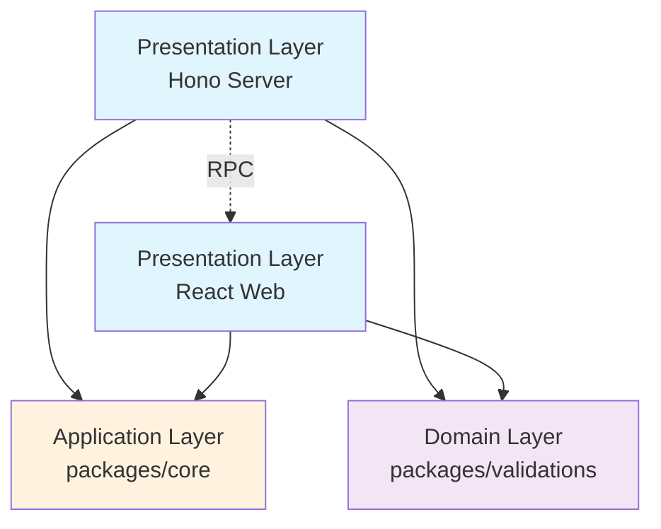

# Clean Architecture Implementation

## Overview

This document describes the Clean Architecture implementation for the BHVR E-commerce project, following Domain-Driven Design (DDD) principles and Clean Architecture patterns.

## Architecture Layers

### 1. Presentation Layer (`apps/`)

- **Server** (`apps/server/`): Hono API endpoints - handles HTTP concerns
- **Web** (`apps/web/`): React frontend with TanStack Router

#### Hono RPC: Type-Safe API Communication

**Hono RPC** fits here as a **communication bridge** between your server and web apps:

```typescript
// Server: Define RPC routes using your validation schemas
import { createProductSchema } from '@bhvr-ecom/validations';

const route = app
  .post('/products', async (c) => {
    const validatedData = createProductSchema.parse(await c.req.json());
    const product = await productUseCases.createProduct(validatedData);
    return c.json(product);
  });

// Export RPC client types
export type AppType = typeof route;
```

```typescript
// Web: Type-safe API calls
import { hc } from 'hono/client';
import type { AppType } from '../server/src/index';

const client = hc<AppType>('/api');
const res = await client.products.$post({ 
  name: 'New Product', 
  price: 29.99 
}); // Fully type-safe!
```

**Why RPC in Presentation Layer:**

- Bridges server (Hono) ↔ web (React) with end-to-end type safety
- Uses `packages/validations` schemas for request/response types
- Keeps business logic (`packages/core`) independent of communication protocol
- Allows swapping REST for GraphQL/RPC without changing business logic

**Why separate HTTP from business logic?**

The Hono server (Presentation Layer) is responsible for **HTTP-specific concerns**:

- Receiving and parsing HTTP requests
- Authentication & authorization middleware
- Request validation and sanitization
- Routing and URL mapping
- Response formatting (JSON, status codes)
- CORS, rate limiting, logging
- Error handling and HTTP status codes

While `packages/core` (Application Layer) contains **business logic**:

- Product catalog management
- Shopping cart operations
- Order processing workflows
- Business rules and calculations
- Transaction management

**Benefits of this separation**:

- **Testability**: Business logic can be tested without HTTP mocks
- **Flexibility**: Could swap Hono for Express/Fastify or add GraphQL/CLI interfaces
- **Maintainability**: HTTP concerns don't pollute business logic
- **Reusability**: Same business logic could power mobile apps, APIs, or background jobs

### 2. Application Layer (`packages/core/`)

Business logic layer containing use cases that orchestrate domain operations.

#### Core Package Structure

```bash
packages/core/
├── src/
│   ├── index.ts           # Exports all use cases
│   ├── products/          # Product management use cases
│   │   └── index.ts
│   ├── cart/             # Shopping cart use cases
│   │   └── index.ts
│   └── orders/           # Order processing use cases
│       └── index.ts
├── package.json
└── tsconfig.json
```

#### Use Cases Implemented

**Products (`packages/core/src/products/index.ts`)**

- `getProducts()` - Retrieve all products with pagination
- `getProductById(id)` - Get single product details
- `getProductsByCategory(categoryId)` - Filter products by category
- `getCategories()` - Retrieve all product categories

**Cart (`packages/core/src/cart/index.ts`)**

- `getCart(userId)` - Retrieve user's cart with items
- `addToCart(userId, productId, quantity)` - Add product to cart
- `updateCartItem(userId, productId, quantity)` - Update cart item quantity
- `removeFromCart(userId, productId)` - Remove item from cart
- `clearCart(userId)` - Empty user's cart

**Orders (`packages/core/src/orders/index.ts`)**

- `createOrder(userId, items, address, couponCode?)` - Create new order
- `getOrderById(orderId)` - Retrieve order details
- `getUserOrders(userId)` - Get user's order history
- `updateOrderStatus(orderId, status)` - Update order status
- `validateCoupon(code)` - Validate coupon code and discount

### 3. Domain Layer (`packages/validations/`)

Validation schemas and domain rules using Zod for type-safe data validation.

#### Validations Package Structure

```bash
packages/validations/
├── src/
│   ├── index.ts           # Exports all schemas and types
│   ├── products.ts        # Product and category schemas
│   ├── cart.ts           # Cart item schemas
│   ├── orders.ts         # Order, address, coupon schemas
│   └── auth.ts           # Authentication schemas
├── package.json
└── tsconfig.json
```

#### Schema Categories

**Products (`packages/validations/src/products.ts`)**

- `createProductSchema` - Product creation validation
- `updateProductSchema` - Product update validation
- `productSchema` - Full product schema
- `categorySchema` - Product category schema

**Cart (`packages/validations/src/cart.ts`)**

- `cartItemSchema` - Individual cart item validation
- `cartSchema` - Complete cart structure

**Orders (`packages/validations/src/orders.ts`)**

- `addressSchema` - Shipping/billing address validation
- `couponSchema` - Discount coupon validation
- `orderItemSchema` - Order line item validation
- `createOrderSchema` - Order creation validation
- `orderSchema` - Complete order schema

**Auth (`packages/validations/src/auth.ts`)**

- `loginSchema` - User login validation
- `registerSchema` - User registration validation

### 4. Infrastructure Layer (`packages/db/`, `packages/env/`, `packages/auth/`)

- **Database** (`packages/db/`): Drizzle ORM schemas and database operations
- **Environment** (`packages/env/`): Configuration management
- **Auth** (`packages/auth/`): Authentication services

## Dependency Flow

```mermaid
apps/server ──┐
apps/web ─────┼─► packages/core ──┐
              │                   │
              └─► packages/validations ──► packages/db
                                    │
                                    └─► packages/env
                                        │
                                        └─► packages/auth
```

## Key Principles Applied

### 1. Dependency Inversion

- Higher-level modules (core) don't depend on lower-level modules (db)
- Both depend on abstractions (interfaces/schemas)

### 2. Single Responsibility

- Each use case handles one business operation
- Each schema validates one domain concept

### 3. Type Safety

- End-to-end TypeScript types from database to API
- Zod schemas provide runtime validation and TypeScript inference

### 4. Testability

- Business logic isolated from infrastructure concerns
- Use cases can be tested independently with mocked dependencies

## Hono RPC Integration

✅ **IMPLEMENTED** - See [Hono RPC Guide](./hono-rpc-guide.md) for complete documentation.

Hono RPC enhances your Clean Architecture by providing **type-safe communication** between presentation layers while leveraging your domain and application layers.

### RPC in Clean Architecture Layers



### Implementation Example

```typescript
// 1. Domain Layer: Define your schemas
import { z } from 'zod';
export const createProductSchema = z.object({
  name: z.string(),
  price: z.number(),
  categoryId: z.string(),
});

// 2. Application Layer: Business logic
export const createProduct = async (data: z.infer<typeof createProductSchema>) => {
  // Business logic here
  return await db.insert(products).values(data);
};

// 3. Presentation Layer (Server): RPC endpoint
import { Hono } from 'hono';
const app = new Hono();

const routes = app
  .post('/products', async (c) => {
    const data = createProductSchema.parse(await c.req.json());
    const result = await createProduct(data);
    return c.json(result);
  });

export type AppType = typeof routes;

// 4. Presentation Layer (Web): Type-safe client
import { hc } from 'hono/client';
const client = hc<AppType>('/api');

// Fully type-safe API call with auto-complete!
const response = await client.products.$post({
  name: 'New Product',
  price: 29.99,
  categoryId: 'electronics'
});
```

### Benefits with Clean Architecture

- **Type Safety**: End-to-end types from validation schemas to frontend
- **Layer Independence**: RPC doesn't affect business logic in `packages/core`
- **Developer Experience**: Auto-complete and compile-time errors for API calls
- **Maintainability**: API changes automatically propagate to frontend types
- **Testing**: RPC client can be mocked without affecting business logic tests

### In Server Routes

```typescript
import { productUseCases } from '@bhvr-ecom/core';
import { createProductSchema } from '@bhvr-ecom/validations';

// Hono handles HTTP concerns: routing, request parsing, response formatting
app.post('/api/products', async (c) => {
  try {
    // 1. HTTP parsing (Presentation Layer)
    const body = await c.req.json();
    
    // 2. Input validation (Domain Layer)
    const validatedData = createProductSchema.parse(body);
    
    // 3. Business logic (Application Layer)
    const product = await productUseCases.createProduct(validatedData);
    
    // 4. HTTP response (Presentation Layer)
    return c.json(product, 201);
  } catch (error) {
    // 5. Error handling (Presentation Layer)
    return c.json({ error: 'Invalid product data' }, 400);
  }
});
```

### Business Logic Testing (Without HTTP)

```typescript
import { productUseCases } from '@bhvr-ecom/core';

// Test business logic directly - no HTTP mocks needed!
describe('Product Use Cases', () => {
  it('should create product with valid data', async () => {
    const product = await productUseCases.createProduct({
      name: 'Test Product',
      price: 29.99,
      categoryId: '123'
    });
    
    expect(product.name).toBe('Test Product');
  });
});
```

### In React Components

```typescript
import { cartItemSchema } from '@bhvr-ecom/validations';

// Type-safe component props
interface CartItemProps {
  item: z.infer<typeof cartItemSchema>;
}

function CartItem({ item }: CartItemProps) {
  // Component logic with full type safety
}
```

## Build Configuration

Enhanced `turbo.json` with proper task dependencies:

```json
{
  "tasks": {
    "build": {
      "dependsOn": ["^build"],
      "outputs": ["dist/**"]
    },
    "dev": {
      "dependsOn": ["^build"],
      "persistent": true
    },
    "check-types": {
      "dependsOn": ["^build"]
    }
  }
}
```

## Benefits Achieved

1. **Maintainability**: Clear separation of concerns makes code easier to modify
2. **Testability**: Business logic can be unit tested without database dependencies
3. **Type Safety**: End-to-end type checking from database to frontend
4. **Scalability**: New features can be added without affecting existing code
5. **Reusability**: Use cases and validations can be shared across different applications

## Migration Notes

This implementation replaces direct database calls in API routes with use case orchestration, providing better separation of concerns and improved testability. All existing functionality is preserved while adding architectural benefits.
